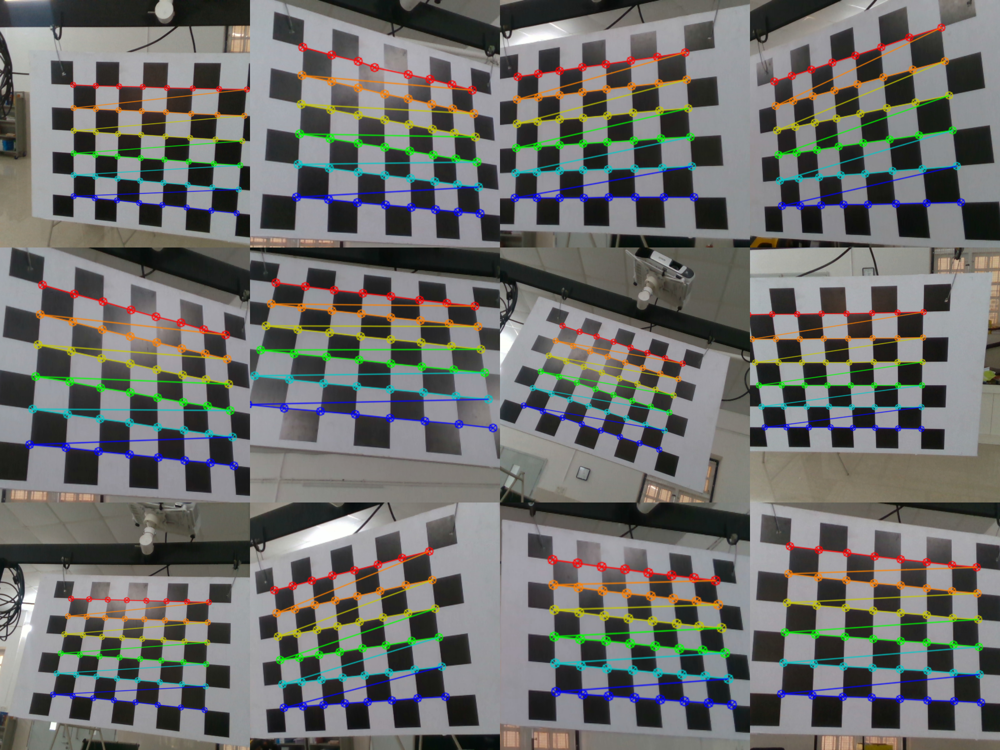

# camera_calibration
This is a code to perform the camera calibration to get the intrinsic parameters of a camera. 
It uses OpenCv in python to calculate the camera matrix using chessboard as the calibration pattern

## Development Environment
- __Ubuntu 16.04.2__
- __OpenCV 3.3.1__

__Step 1: Capture the images__

- Keep the calibration pattern (chessboard) fixed
- Cpture the image of the calibration pattern using the camera.
- Move the camera to new position and capture the next image.
- Repeat the procedure for alteast 15 images captured from random positions at random angles

__Step 2: Load the images__

- load the captured images to the /images folder

__Step 3: Run the calibration program__

- Run the python program extract_camera_intrinsics.py
- Pass the arugment -a as "False" to visualise the captured images

  ```python extract_camera_intrinsics.py -a False```
- Press key 's' to include the images in the calibration calculation. Press 'd' to exlude the image.
- Repeat the the procedure untill all the images in the "images" folder is excecuted. 

<p align="center">    

</p>
