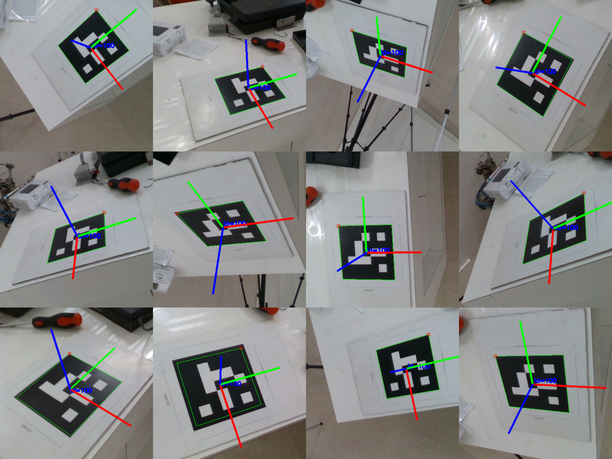

# HandEye Calibration

This is a package to perform the hand to eye calibration to get the transformation between the robot end effector and camera. Here we used aubo_15 robot and intelrealsense D435 depth camera. Here we use a aruco marker (100 D7) as the calibration image. 

## 1. Development Environment
- Ubuntu 16.04.2
- ROS Kinetic

## 2. ROS Package Dependencies
- aubo_robot
- [realsense-ros](https://github.com/IntelRealSense/realsense-ros)
- [visp_hand2eye_calibration] (http://wiki.ros.org/visp_hand2eye_calibration)

__Step 1: Install the dependencies__

Clone the aubo_robot package and relsense D435 packages from [here](https://github.com/abhishekpg111/pick-and-place)

Install the realsense wrappers as described [here](https://github.com/IntelRealSense/librealsense/blob/master/doc/distribution_linux.md#installing-the-packages)

Install the visp_hand2eye_calibration pakcage

__Step 2: Experiment setup__

attach the camera on the last link of the robot

__Step 3: Bring up the camera and robot__

Run the camera and robot launch files to bring it up.

    roslaunch realsense2_camera rs_camera.launch
    roslaunch aubo_gripper_moveit_config moveit.launch
__Step 4: Run the calibration node__

    rosrun handeye_calibration calibrator.py
__Step 5: Capture the image__

Move the robot atleast to minimum random 15 positions and capture the image of he calibration pattern. Press enter to capture image. Press 'y' to finish the calibration process after capturing all the images. 

    

